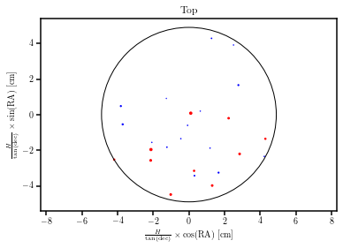
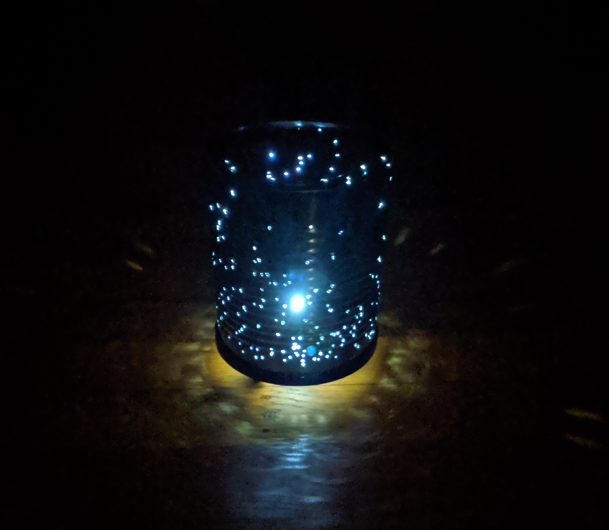

# Celestial Can

*"If the stars were mine, I'd tell you what I'd do. I'd put the stars right in a jar and give them all to you"*
 Melody Gardot

Build your own accurate planetarium by poking holes in a metal can and putting an LED inside, to project the stars on your ceiling.
Input the radius and height of your can, select how many stars you want to see and which hemisphere, and get images to print and stick on the can to know where to poke the holes.

The top of the can will look something like this:

Did you recognize the big dipper? It appears inverted because you are looking from the top of the can. The LED will project the image on your ceiling with the right orientation.

And the side image, to be wrapped around the side of the can:

Stick the template on your can, making sure that RA=0 coincides on the top and the side of the can, and you are good to go! 

